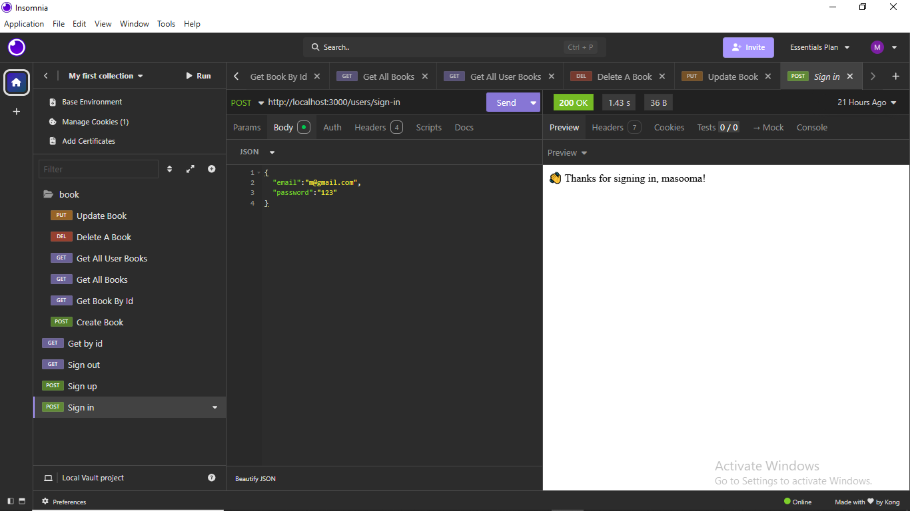
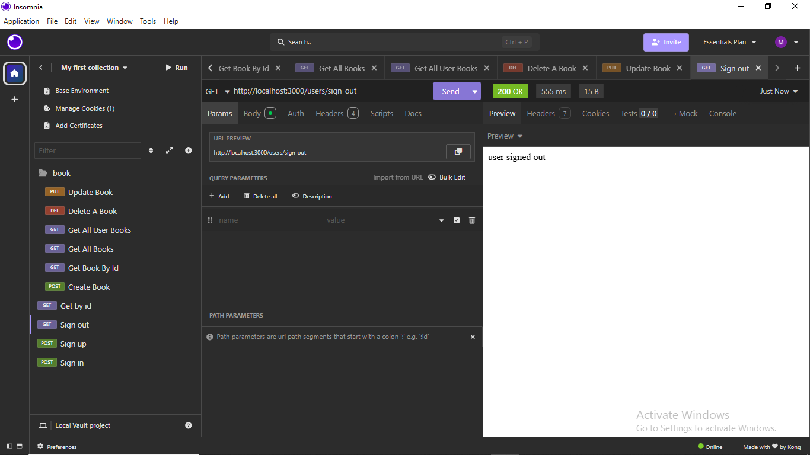

# Project 2

## Date: 10/6/2026

### Created By: Masooma Ebrahim

[GitHub](https://github.com/masooma99)
[LinkedIn](https://www.linkedin.com/in/masoomaebrahim99/)

### ***Description***
#### this project represent a simple API endpoints get and post only where users can sign up "using post" by creating a user if the user enter a valid information and adding the information to the database which I used mongodb as my database and sign in which will "get" the data from the data base and compare it to the data that the user entered, data should also be securely stored, and as a developer, never trust the users so always make sure that the data entered by the user is acuret.
since this project is only for backend I mostly used res.send() for sending success or error message or for sending a data from the database as json.
***

### ***Technologies Used***
* js
* json
***

### ***Getting Started
Sign up

Sign in

Sign out

Get user by id

### ***Future Updates***

- [ ]
- [ ]
- [ ]
***
