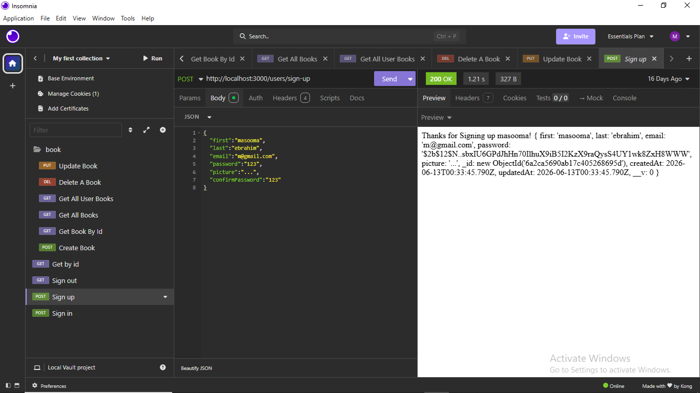
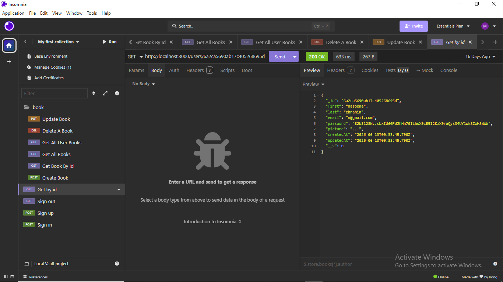
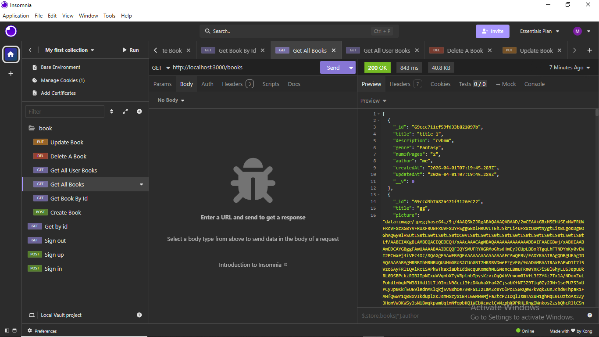
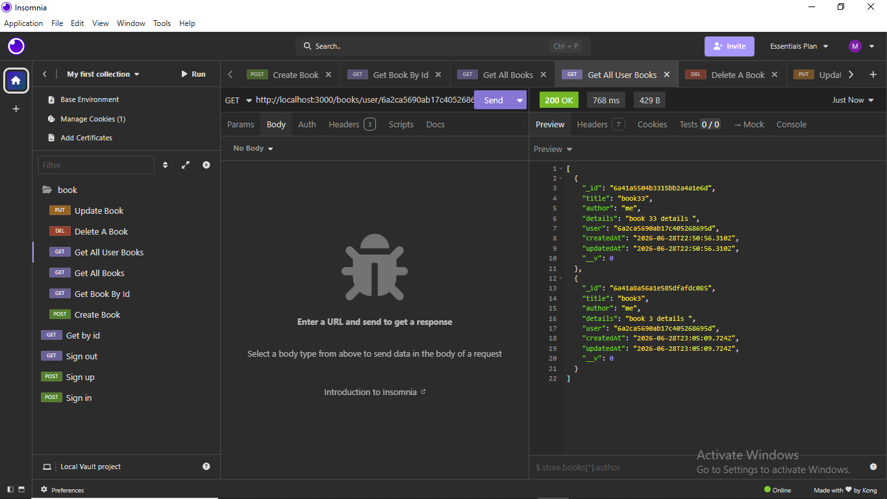
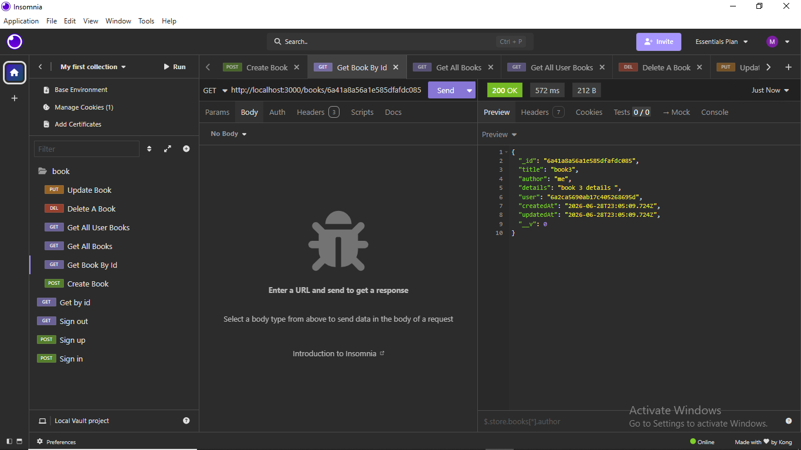
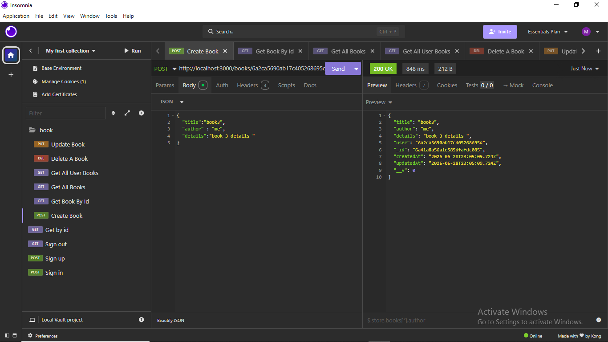
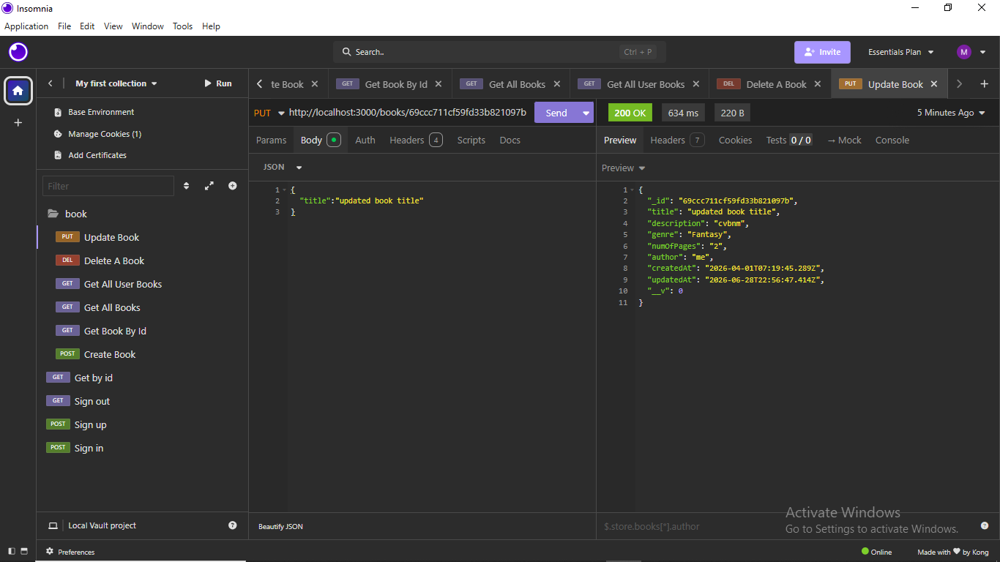
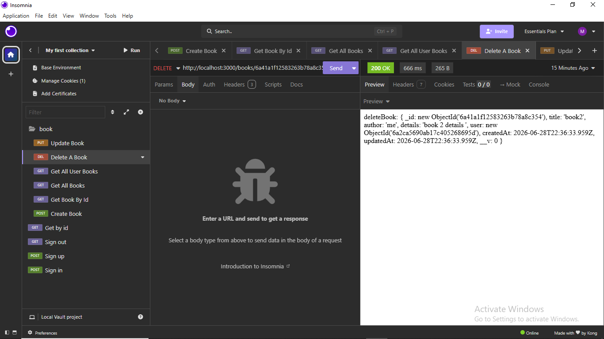

# Project 3

## Date: 27/6/2026

### Created By: Masooma Ebrahim

[GitHub](https://github.com/masooma99)
[LinkedIn](https://www.linkedin.com/in/masoomaebrahim99/)

### ***Description***
#### In this project I add a simple sign up, sign in validation "using post" and get user information "using get" and using full CRUD operation by creating a book by a specific user, getting the book info, updating the book info, and deleting a book, The user can create books, and get all books that he created where he will be able to update and delete the books and he could also see all the books that have been created by other users.
#### for now all the work is in the backend only but for a future update I'm thinking of using ejs or react for thr frontend.
***

### ***Technologies Used***
* js
* json
* db
***

### ***Getting Started
Sign up

Sign in

Sign out

Get user by id

### Book Details

Get all books

Get all books added by user

Get book by ID

Create a new book

Update book details

Delete book

### ***Future Updates***

- [ ] Front end development
***
